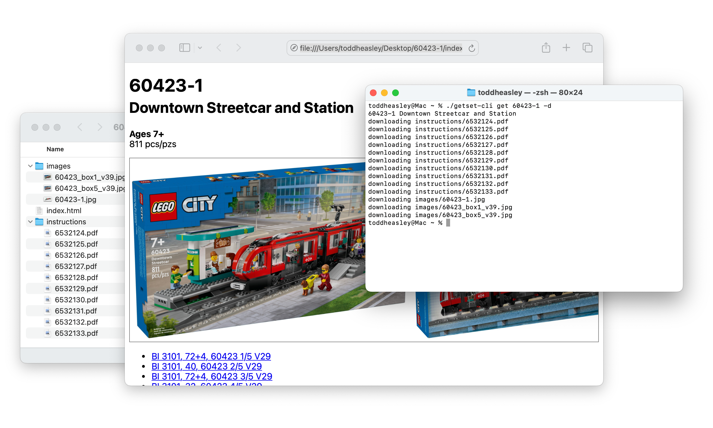

# `GetSet`

__Get LEGO® set info, images and instructions from [Brickset](https://brickset.com/article/52664/api-version-3-documentation)__

`GetSet` extends `URLSession` with async/await functions that return deserialized, modeled set info and media URLs. Search sets by set number, name or keyword query.

Requires a free [Brickset API key](https://brickset.com/tools/webservices/requestkey), persisted safely in the system keychain.

## Command-line interface



`GetSet` includes a basic CLI that downloads data, images and building instructions for a given set number, name or keyword query. Demonstrates using the `GetSet` extensions to `URLCredential` and `URLSession`.

### CLI Examples

Set and validate Brickset API key:

```zsh
./getset-cli key 3-26cC-J3gUn-63bi
```

Download images and instructions for a specific set:

```zsh
./getset-cli get 60098-1 -d
```

Read the manual:

```zsh
./getset-cli -h
```

### Supported Platforms

Written in [Swift](https://developer.apple.com/swift) 6 for Apple stuff:

* [macOS](https://developer.apple.com/macos) 15 Sequoia
* [iOS](https://developer.apple.com/ios)/[iPadOS](https://developer.apple.com/ipad)/[tvOS](https://developer.apple.com/tvos) 18
* [watchOS](https://developer.apple.com/watchos) 11
* [visionOS](https://developer.apple.com/visionos) 2

Build with [Xcode](https://developer.apple.com/xcode) 16 or newer. Command-line interface depends on [Swift Argument Parser.](https://github.com/apple/swift-argument-parser)
