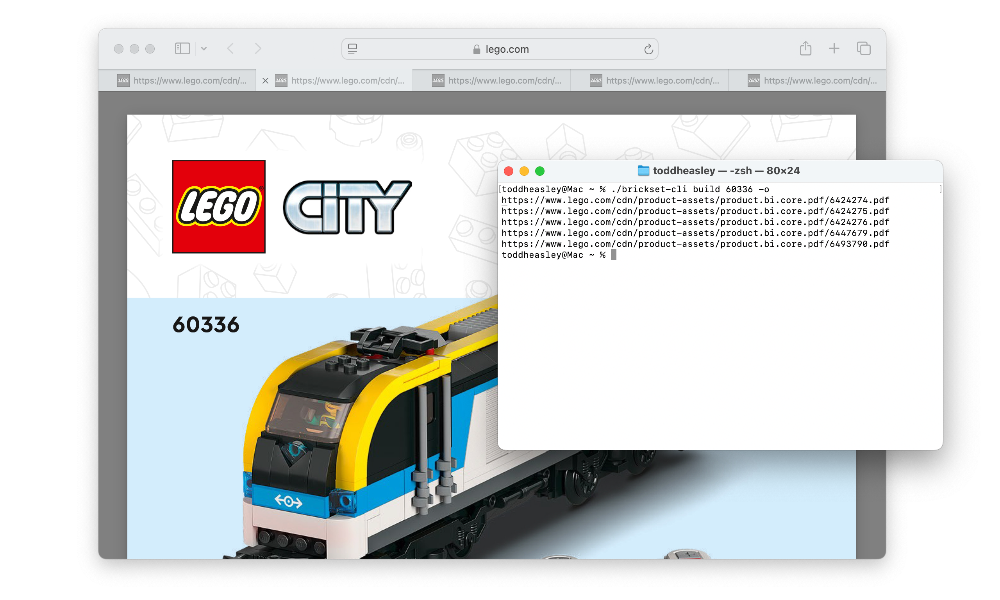

# `Brickset`

__Complete Swift interface to the [Brickset API version 3](https://brickset.com/article/52664/api-version-3-documentation)__

Search [LEGO](https://www.lego.com) sets and minifigs by set number, name, era and theme. Look up set metadata, building instructions and images for almost every LEGO set. Even manage collections for individual Brickset accounts.

## Command-line interface



`Brickset` package includes executable target `brickset-cli`, a basic command-line interface for searching LEGO sets and reading building instructions. `brickset-cli` demonstrates using `Brickset` extensions to `Foundation` `URLCredential` and `URLSession` types for fine-grained control of secret storage and networking.

### CLI Examples

```zsh
% ./brickset-cli key 3-26cC-J3gUn-63bi
API key: •••••••••••••••••
```

```zsh
% ./brickset-cli search "heavy haul"  
2 sets matched "heavy haul":
➤  7998 Heavy Hauler
➤ 60098 Heavy-Haul Train
```

```zsh
% ./brickset-cli build 60098 -o       
https://www.lego.com/cdn/product-assets/product.bi.core.pdf/6125616.pdf
https://www.lego.com/cdn/product-assets/product.bi.core.pdf/6125620.pdf
https://www.lego.com/cdn/product-assets/product.bi.core.pdf/6125622.pdf
https://www.lego.com/cdn/product-assets/product.bi.core.pdf/6201488.pdf
https://www.lego.com/cdn/product-assets/product.bi.core.pdf/6201493.pdf
https://www.lego.com/cdn/product-assets/product.bi.core.pdf/6201498.pdf
```

### Supported Platforms

Written in [Swift](https://developer.apple.com/swift) 6 for Apple stuff:

* [macOS](https://developer.apple.com/macos) 15 Sequoia
* [iOS](https://developer.apple.com/ios)/[iPadOS](https://developer.apple.com/ipad)/[tvOS](https://developer.apple.com/tvos) 18
* [watchOS](https://developer.apple.com/watchos) 11
* [visionOS](https://developer.apple.com/visionos) 2

Build with [Xcode](https://developer.apple.com/xcode) 16 or newer. Command-line interface depends on [Swift Argument Parser.](https://github.com/apple/swift-argument-parser)
